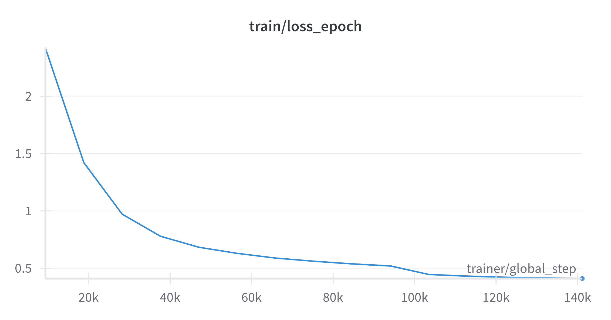
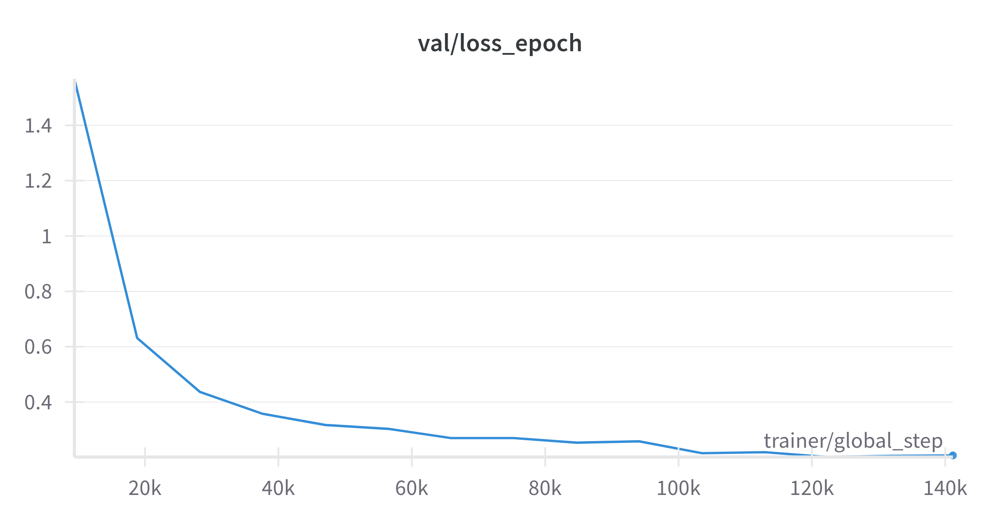
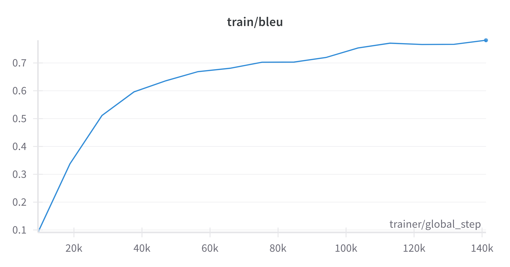
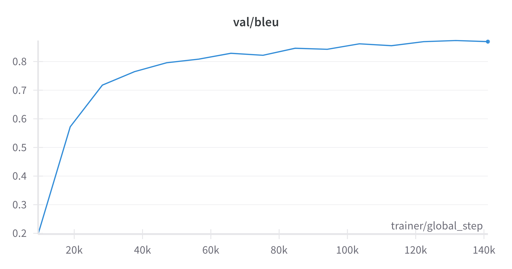
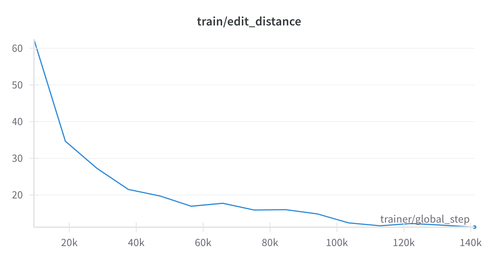
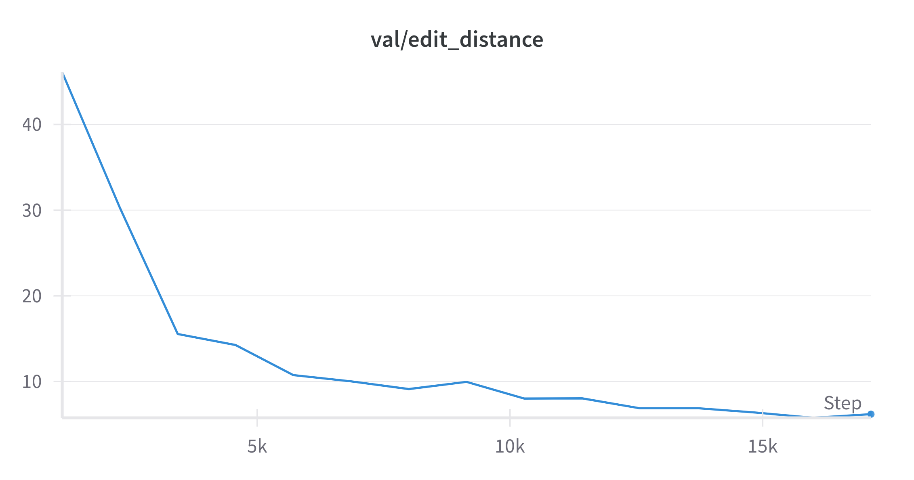
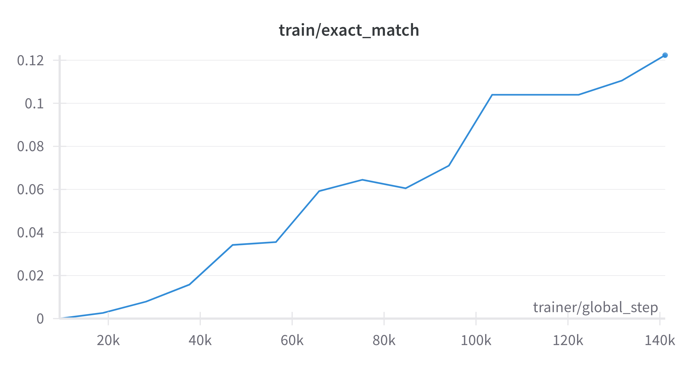
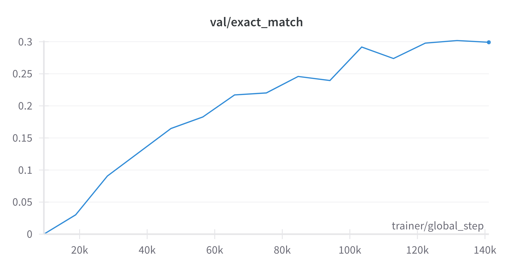

**Watch out AI-generated document at:**
<div align="center">

[](https://deepwiki.com/quangliz/image-to-latex)

</div>

---

# Image to LaTeX
A deep learning model that converts images of mathematical formulas into LaTeX code. This project uses a ResNet-Transformer architecture to accurately transcribe mathematical notation from images.

## Architecture

The model architecture combines a ResNet backbone with a Transformer decoder:

1. **ResNet Encoder**: Extracts visual features from the input image of a mathematical formula
2. **Transformer Decoder**: Generates the corresponding LaTeX code sequence

This architecture leverages the power of convolutional neural networks for image feature extraction and the sequence modeling capabilities of transformers for generating accurate LaTeX code.

## Model Performance

After training for 15 epochs, the model achieved the following metrics:

| Metric | Training | Validation | Test |
|--------|----------|------------|------|
| BLEU Score | 0.7817 | 0.8696 | 0.8106 |
| Character Error Rate (CER) | 0.1603 | 0.0865 | 0.1428 |
| Edit Distance | 11.2316 | 6.1908 | 15.2986 |
| Exact Match | 0.1224 | 0.2992 | 0.2515 |
| Loss | 0.4098 | 0.2072 | - |

### Training Progress

| Training | Validation |
|---------------|-----------------|
|  |  |
|  |  |
|  |  |
|  |  |


## Usage
- Clone the repository:
```
git clone https://github.com/quangliz/image-to-latex.git
cd image-to-latex
```
- Install virtual environment and requirements:
```
python3 -m venv .venv
source .venv/bin/activate
pip install -r requirements.txt
```
- Prepare data:
```
python scripts/prepare_data.py
```
- Train the model:
```
python main.py train
```
- Inference:
```
python main.py infer --image <path_to_image> --checkpoint <path_to_checkpoint>
```

## Features

- **Raw Image Processing**: The model processes raw images without requiring pre-cropping
- **Multiple Metrics**: Evaluates performance using BLEU score, Character Error Rate (CER), Edit Distance, and Exact Match
- **Optimized Training**: Efficient training process with metrics calculated only at epoch boundaries

## Dataset

This model was trained on the [Im2Latex-100K dataset](https://im2markup.yuntiandeng.com/data/), which contains:
- 100k+ images of mathematical formulas
- Corresponding LaTeX code for each image
- Train/validation/test splits

## Implementation Details

- **Framework**: PyTorch and PyTorch Lightning
- **Backbone**: ResNet-18 with first 3 layers
- **Decoder**: Transformer
- **Optimizer**: AdamW 
- **Scheduler**: MultiStepLR

## Use the API
```
cd api
python3 main.py
```
## Future Works

- [ ] Experiment with different backbone architectures
- [ ] Add support for handwritten mathematical formulas
- [ ] Implement beam search for better inference
- [x] Build API
- [ ] Clean and refactor code
- [x] Document project

<div align="center">
